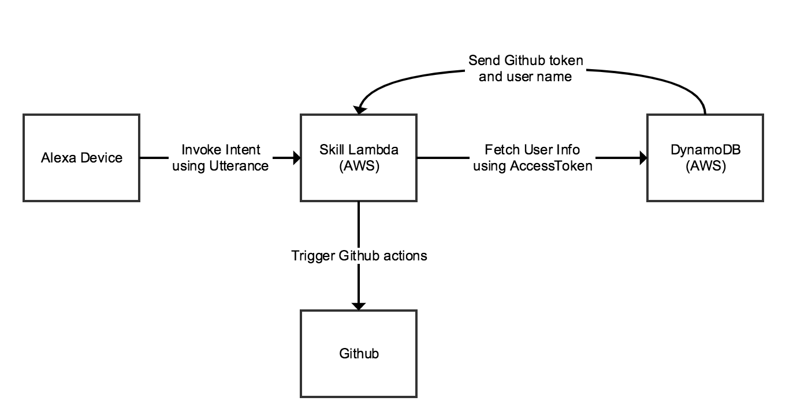
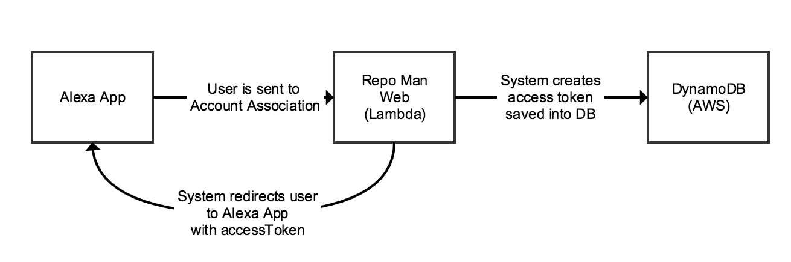

# lambda_alexa_skill_repoman
Alexa Skill - My Repo Manager. - Manage your github account using Alexa!

## Overview
This guide outlines the technology, installation steps, 
what can be done with the tool, and a few other things.

## Architecture & Tech
### Architecture
Intent Flow

### Technology
1. AWS Alexa
2. AWS API Gateway
3. NodeJS 6.10
4. AWS Lambda
5. AWS DynamoDB

### External Systems
1. Alexa Device
2. Alexa NLP
3. Github

### DB Table
Table Name: Repoman_Users

Columns:  

| Column Name    | Description  | 
| -------------- |------------- |
| email          | user's email address |
| accessToken    | access token created by us and used by AWS Alexa asswell. |
| clientId       | Application Client Id |
| githubToken    | User provided Github Token |
| githubUsername | User provided Github Username |
| password       | System password |
| passwordSalt   | System password salt |

## Install Guide
### Alexa Lamdba and Skill
At the moment there is only a single way to deploy the lambda.  
1.  Zip the contents of this directory
2.  Upload the zip file to your lamdba.

In the future I will be utilizing Serverless Framework to do auto 
deploys

### Alexa Skill
To install the Alexa skill use the JSON file within the alexa-source
directory. And paste it into the Alexa Skill Code editor within the Configuration tool.
The file contains the code used in the Alexa Configuration Tool
  
  
## Features
The below is a list of all features the Alexa Skill can accomplish.  
All utterances must start with the traditional methods when invoking a skill.

### Repositories
#### Create a new repository
Allows a user to create a new repository within github.

##### Utterances
* "Alexa, Ask Repo man to create a new repo called testing 123"
* "Alexa, lets go ahead and create a new repo using Repo Man" (Will trigger Delegate Dialogs)

### Branches
#### Create a new branch
Allows a user to create a new branch within a repo.

##### Utterances
* "Alexa, Ask Repo man to create a new branch branch 123 on repo XYZ"
* "Alexa, create a new branch" (Delegate Dialog triggered)

#### Merge Branch
Allows a user to merge a specific branch into a base branch.

##### Utterances
* "Alexa, Ask Repoman to merge X branch into master"
* "Alexa merge test branch into master" (Delegate Dialog)

### Pull Requests (PR)
#### Close a Pull Request
Allows a user to close a specific PR using the PR number

##### Utterances
* "Alexa, Ask Repo man to close PR 123"
* "Alexa close pull request 123" (Delegate Dialog)

#### Get total number of PRs for repo
Allows the user to get the total number of PRs.  Can also be filtered by type.

Types
1.  closed
2.  opened

Delegate Dialog will trigger for all utterances below

##### Utterances
* "Alexa, Ask Repo man how may PRs are there?"
* "Alexa, Ask Repo man how may OPEN PRs are there?"

#### Get the status of a specific PR
Allows the user to get the status of a PR using its number

Delegate Dialog will trigger for all utterances below

##### Utterances
* "Alexa, Ask Repo man what's the status of PR 123?"
* "Alexa use repo man to get the status of PR 123 on repo XYX"

## Security
### Account Linking
All commands must carry an accessToken provided and received during the 
Alexa App, Account Linking process.   The accessToken is associated to a single
Alexa/Repo man user.

### Github Token
All accounts must provide a Githb personal token. Users can remvoke this token
any time they wish from within Github.  Users are also given the option to allow
specific permissions for the provided token.

### Roles and Policies
Not using a AWS key.  Policies are tied to a role the lambda uses.

### What I also tried.
1. Associating 1 account to 1 device by looking at the device Id the user registered on 
and requiring that during each call.  This would force a users to use the skill on a single device 
but that wouldnt have worked because Alexa does not send us the device Id.  

2.  I also checked if they send us a user id during account association/linking.  

Security must be tighten up in the DB side though.

So what I want to do next is
1.  Create a string that includes all the data i need.  
2.  Encrypt the string
3.  Place this encrypted string into a JWT. This will check for expiration and structure.

## Todo's
There are a few things I would like to add onto the system.
1. Unit Tests
1. Install using serverless framework
1. Security

## General Thoughts & What I learned
1. Will not allow for deletion of branches and repos.  These are permanent 
requests that can have detrimental effects. 
1. `this.event` has pretty much all I need. Access to `intent`, `dialogState` etc.
1. How to associate a device to the system.
1. How to use Delegate Dialogs and configure them.
1. Its best to confirm with the user what they want done.  Forcing AWS NLP to repeat what the user has just triggered. 
There's been numerous occasions where "dog" has been inserted instead of the name/word I used. 
1. The turn based dialogs, I feel are a must at this point since there 
are many times Alexa doesnt get what you said correctly so it uses something
else as a repo name, branch name etc.  Confirming with the user gives a good way to 
increase confidence.
1. You know when we use turn based slot confirmation the last confirmation asked to the user for the complete thing doesnt sound 
natural.  Makes me feel as if I want to tell alexa...Jeez dude! do it already!!! Maybe its better to ask for slot confirmation and not intent confirmation?
   
## Improving
1. Logging - we need to log not only the slots but also the utterances the user has used.  This will give us further examples as to how users 
verbally trigger an intent.

## References
1.  NPM Github API - http://mikedeboer.github.io/node-github/#api-pullRequests
2.  Linking Users from one system to Alexa - https://developer.amazon.com/public/solutions/alexa/alexa-skills-kit/docs/linking-an-alexa-user-with-a-user-in-your-system
3.  Alexa sdk NPM - https://www.npmjs.com/package/alexa-sdk